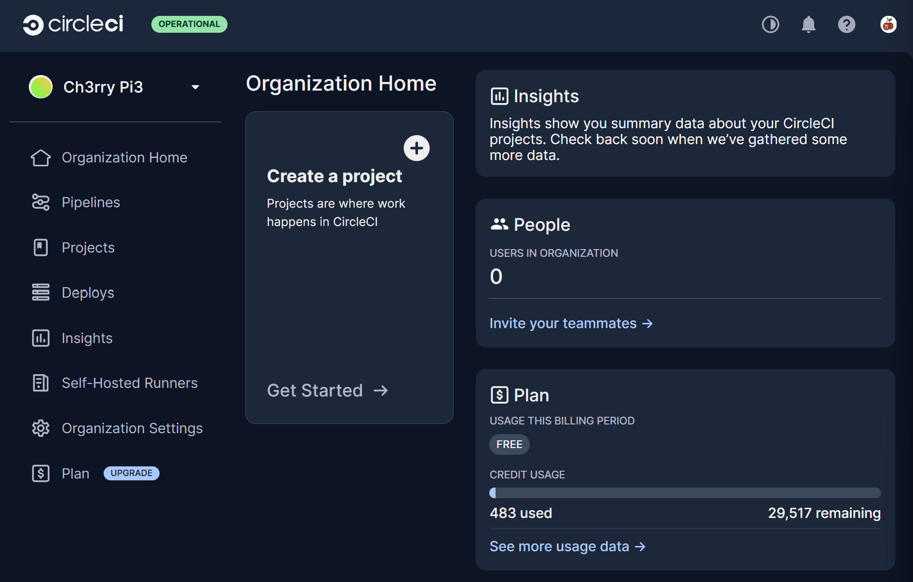
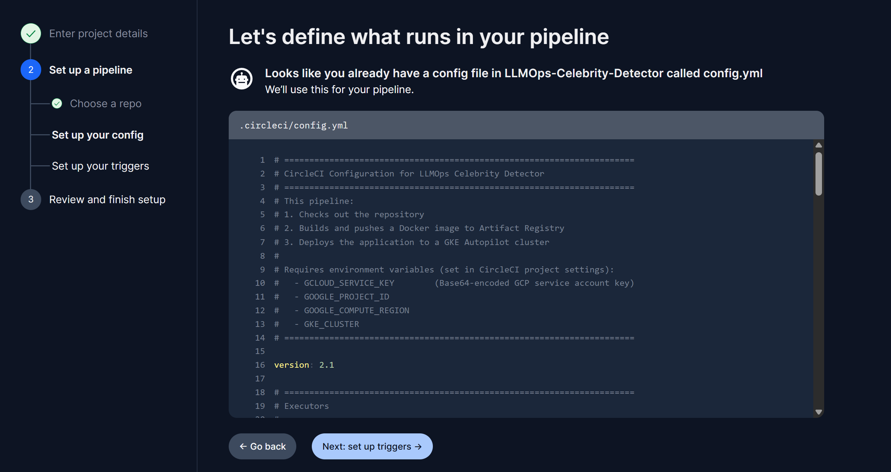
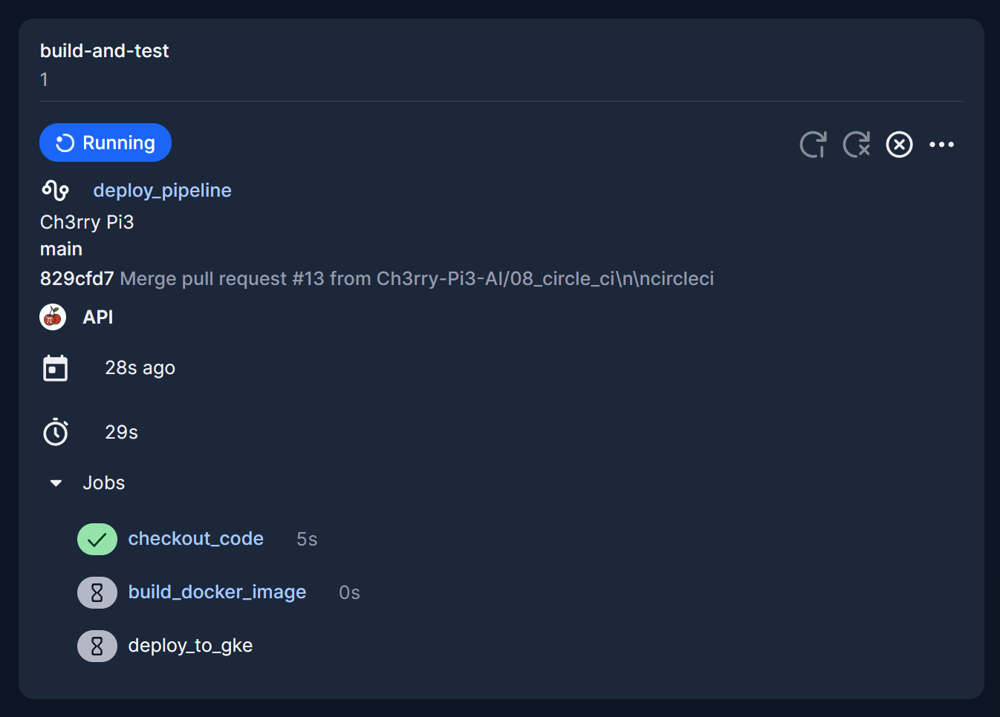

# ☁️ **CircleCI + GKE Deployment Setup — LLMOps Celebrity Detector**

This branch introduces full CI/CD integration for the LLMOps Celebrity Detector.
You will encode your GCP service account key, configure CircleCI, link your GitHub repository, set environment variables, and prepare your GKE cluster to receive deployments.

Once complete, every push to GitHub will automatically:
• Build your Docker image
• Push it to Artifact Registry
• Deploy it to your GKE Autopilot cluster

This enables a fully automated MLOps deployment pipeline.

## 🗂️ **Project Structure (Updated)**

Only the new files for this branch are annotated.

```text
LLMOPS-CELEBRITY-DETECTOR/
├── .circleci/
│   └── config.yml                 # NEW: CircleCI build & deploy pipeline
├── .venv/
├── app/
│   ├── __init__.py
│   ├── routes.py
│   └── utils/
│       ├── __init__.py
│       ├── image_handler.py
│       ├── celebrity_detector.py
│       └── qa_engine.py
├── static/
├── templates/
├── gcp-key.json                   # NEW: Raw GCP service account key (DO NOT COMMIT)
├── .env
├── .gitignore                     # Updated: now ignores gcp-key.json
├── .python-version
├── Dockerfile
├── kubernetes-deployment.yaml
├── app.py
├── pyproject.toml
├── README.md
├── requirements.txt
├── setup.py
└── uv.lock
```

## 🔐 Convert `gcp-key.json` to Base64

CircleCI requires the GCP key to be stored as Base64.
Run this command in your terminal:

```bash
cat gcp-key.json | base64 -w 0
```

Copy the output.
This single-line Base64-encoded string will be used in CircleCI as `GCLOUD_SERVICE_KEY`.

## ⚙️ Set Up the CircleCI Configuration

Create a folder and config file in your project root:

```
.circleci/config.yml
```

Copy the pipeline configuration you were given.
Commit the file and push it to GitHub so CircleCI can detect it.

### Create the CircleCI Project

1. Log into CircleCI (Google login is fine).
2. Create a new project.

<p align="center">
  
</p>

3. Choose **Build, test, and deploy your software application**.
4. Name it **LLMOps**.
5. Connect CircleCI to GitHub and select your repository:

```
LLMOps-Celebrity-Detector
```

Make sure `.circleci/config.yml` is already pushed or CircleCI will not detect the pipeline.

<p align="center">
  
</p>

### Set CircleCI Environment Variables

Navigate to:

**Project → Settings → Environment Variables**

Add the following:

| Variable                | Value                 |
| ----------------------- | --------------------- |
| `GCLOUD_SERVICE_KEY`    | Your Base64 GCP key   |
| `GOOGLE_PROJECT_ID`     | Your GCP project ID   |
| `GKE_CLUSTER`           | Your GKE cluster name |
| `GOOGLE_COMPUTE_REGION` | Your compute region   |

After saving these, CircleCI is ready to authenticate to Google Cloud.

### Trigger the Pipeline

Make any push to the GitHub repo and CircleCI will automatically start your pipeline.

<p align="center">
  
</p>

## 🔑 Set Up LLMOps Secrets in GKE

Access your GKE cluster via the console:

1. Open GKE Console
2. Go to Workloads
3. Select your workload
4. Open the built-in kubectl terminal

### Authenticate kubectl to your cluster

Run:

```bash
gcloud container clusters get-credentials llmops \
--region us-central1 \
--project sacred-garden-474511-b9
```

### Create the Kubernetes secret for your LLM API key

```bash
kubectl create secret generic llmops-secrets \
--from-literal=GROQ_API_KEY="your_actual_groq_api_key"
```

Your Kubernetes deployment file will reference this secret for secure access.

## ✅ In Summary

This branch adds:

• The full CircleCI pipeline (`.circleci/config.yml`)
• The GCP key (stored locally, ignored in Git)
• CircleCI environment variable configuration
• GKE secret creation
• GitHub-triggered automated deployments

Your deployment workflow is now automated end-to-end.
