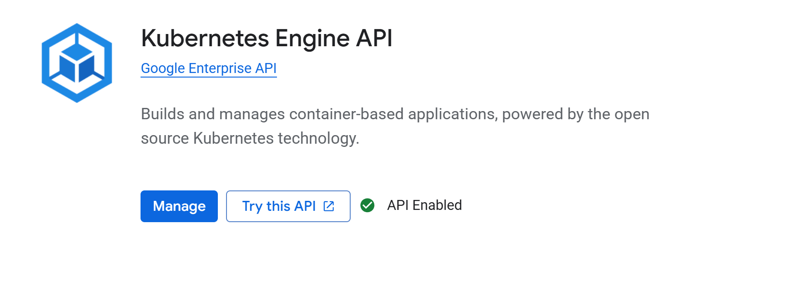
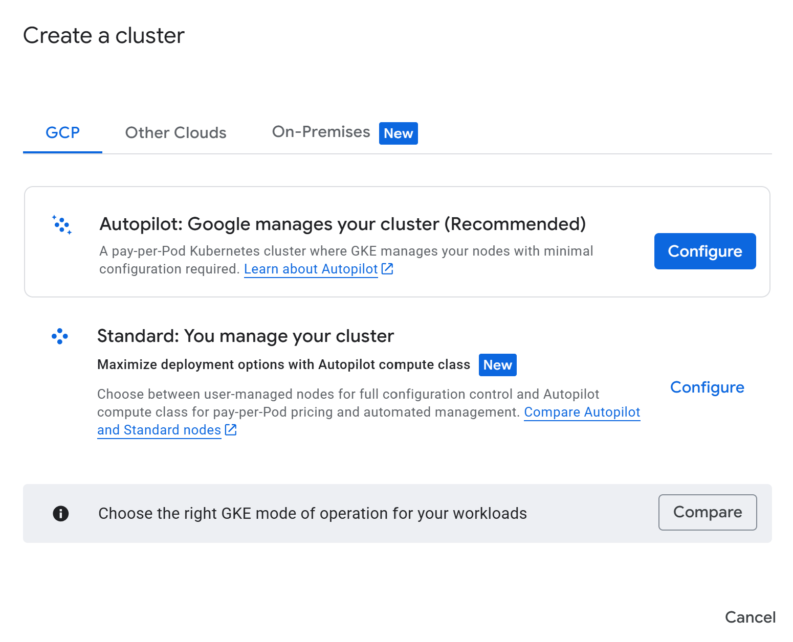
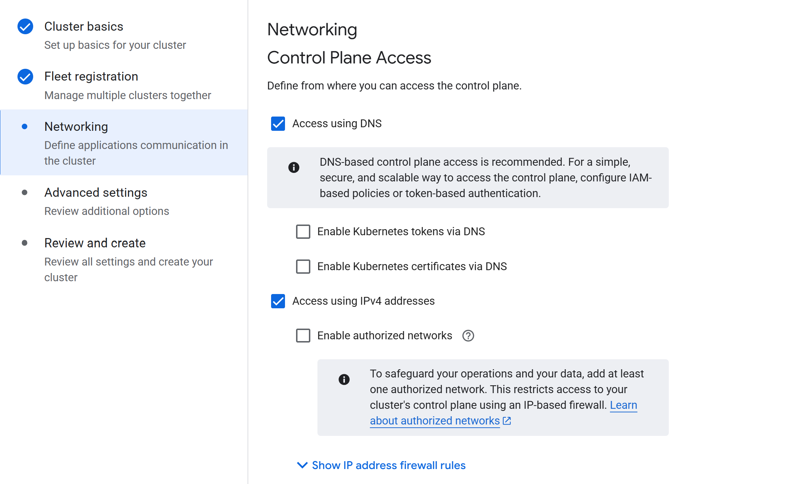

# ☁️ **Google Cloud Platform Setup — LLMOps Celebrity Detector**

This branch prepares the **Google Cloud Platform (GCP)** environment required for deploying the LLMOps Celebrity Detector.
It covers enabling APIs, creating the GKE Autopilot cluster, configuring Artifact Registry, and generating service accounts with proper permissions.

Once completed, your project becomes cloud-ready for containerisation, deployment, and CI/CD automation.

## 🗂️ **Project Structure (Updated)**

Only the **newly added** or cloud-specific asset is annotated.

```text
LLMOPS-CELEBRITY-DETECTOR/
├── .circleci/
├── .venv/
├── app/
│   ├── __init__.py
│   ├── routes.py
│   └── utils/
│       ├── __init__.py
│       ├── image_handler.py
│       ├── celebrity_detector.py
│       └── qa_engine.py
├── static/
├── templates/
├── gcp-key.json                     # NEW: GCP service account key (DO NOT COMMIT)
├── app.py
├── Dockerfile
├── kubernetes-deployment.yaml
├── .env
├── .gitignore                       # Updated: gcp-key.json added to ignore list
├── .python-version
├── pyproject.toml
├── README.md
├── requirements.txt
├── setup.py
└── uv.lock
```

## 🔑 **1. Enable Required GCP APIs**

In the GCP Console:

Navigation → **APIs & Services → Library**

Enable the following APIs:

* Kubernetes Engine API
* Container Registry API
* Compute Engine API
* Cloud Build API
* Cloud Storage API
* IAM API

### Kubernetes Engine API

<p align="center">
  
</p>

## 🛠️ **2. Create GKE Cluster & Artifact Registry**

### Create a GKE Autopilot Cluster

1. Go to the GCP Console and search for **GKE**
2. Click **Create Cluster**
3. Select the **Autopilot** option

<p align="center">
  
</p>

Name the cluster:

```
llmops
```

### Networking Configuration

Inside the cluster creation flow, open the **Networking** tab and apply the recommended settings as needed.

<p align="center">
  
</p>

### Create Artifact Registry

1. Search for **Artifact Registry** in the GCP Console
2. Click **Create Repository**
3. Use the following settings:

```
Name: llmops-repo
Format: Docker
Region: us-central1 (Iowa)
```

This will act as your storage for container images.

## 🔐 **3. Create a Service Account & Assign Permissions**

Navigate to:

**IAM & Admin → Service Accounts**

Create a new service account:

```
Name: celebrity
```

### Assign Roles

Grant the following roles:

* Storage Object Admin
* Storage Object Viewer
* Owner
* Artifact Registry Admin
* Artifact Registry Writer

### Create and Download JSON Key

1. Click the **three vertical dots (Actions)**
2. Select **Manage keys**
3. Click **Add key → Create new key**
4. Download the `.json` file

Place it in the project root:

```
gcp-key.json
```

Add to `.gitignore`:

```
gcp-key.json
```

This prevents the key from ever being pushed to GitHub.

## 📦 **What This Branch Enables**

After completing this branch you now have:

* A fully configured GCP project
* All required APIs enabled
* A production-ready GKE Autopilot cluster (`llmops`)
* A Docker Artifact Registry (`llmops-repo`)
* A secure service account for deployments and CI/CD
* A JSON key allowing controlled authenticated access

This creates the foundation for:

* Docker build and push stages
* GitHub Actions or CircleCI pipelines
* Kubernetes deployments
* End-to-end MLOps infrastructure

## 🧩 **Integration Notes**

| Component         | Role                                                 |
| ----------------- | ---------------------------------------------------- |
| `gcp-key.json`    | Authenticates container pushes & cluster deployments |
| GKE Autopilot     | Runs your Flask/LLM app inside managed Kubernetes    |
| Artifact Registry | Stores Docker images for deployment                  |
| Enabled APIs      | Unlock GKE, storage, IAM, build automation           |

## ✅ **In Summary**

This branch establishes all essential GCP infrastructure needed for the LLMOps Celebrity Detector.
