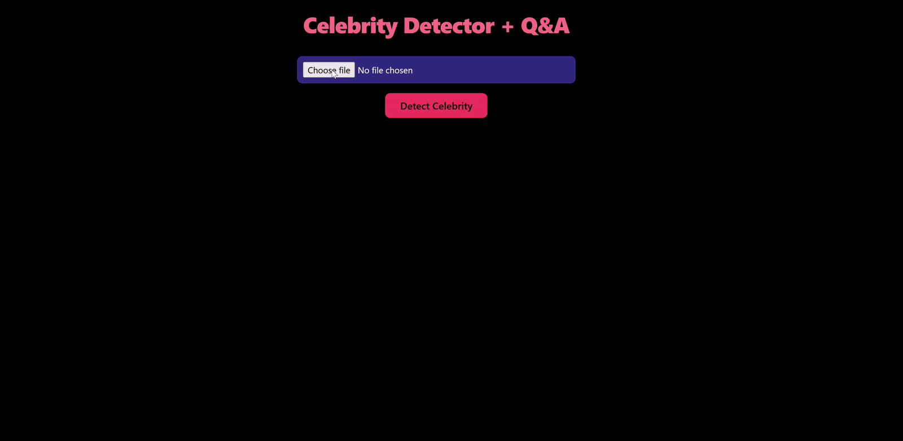

# 🎬 **LLMOps Celebrity Detector — Project Overview**

This repository presents a full **LLMOps workflow** for a real-time **celebrity recognition and Q&A system**, powered by computer vision and Large Language Models.
The application allows users to upload an image, detect the largest face, identify the celebrity using Groq’s multimodal model, and ask follow-up questions — all wrapped inside a Flask web interface and deployed via Kubernetes with a fully automated CI/CD pipeline on GCP + CircleCI.

<p align="center">
  
</p>

<p align="center">
  
</p>

## 🧩 **Grouped Stages**

|    #   | Stage                           | Description                                                                                                                                     |
| :----: | :------------------------------ | :---------------------------------------------------------------------------------------------------------------------------------------------- |
| **00** | **Project Setup**               | Established the initial repository structure, module packaging (`setup.py`), environment files, virtual environment, and base utilities folder. |
| **01** | **Image Handler**               | Implemented image decoding, preprocessing, grayscale conversion, OpenCV Haar-cascade face detection, and annotated image output.                |
| **02** | **Celebrity Detector**          | Added the multimodal Groq-powered celebrity recognition module (base64 encoding, structured LLM output, automatic name extraction).             |
| **03** | **Q&A Engine**                  | Developed follow-up question answering using the celebrity’s name and Groq text-based LLM responses.                                            |
| **04** | **Routes (Flask Logic)**        | Implemented the routing layer that connects image uploads, recognition logic, Q&A, and HTML template rendering.                                 |
| **05** | **Flask Application**           | Created the full web application (templates, CSS, routes, blueprint registration, and `app.py` entrypoint).                                     |
| **06** | **Dockerfile & Kubernetes**     | Authored the Dockerfile, added the Kubernetes Deployment manifest, and prepared the container for cloud deployment.                             |
| **07** | **Google Cloud Platform Setup** | Enabled APIs, created Artifact Registry, provisioned GKE Autopilot cluster, configured IAM roles, and generated the service account key.        |
| **08** | **CircleCI Pipeline**           | Built a fully automated CI/CD pipeline: Docker build → push to Artifact Registry → rollout deployment to GKE via `kubectl`.                     |

## 🗂️ **Project Structure**

```text
LLMOPS-CELEBRITY-DETECTOR/
├── app.py                           # Flask application entrypoint
├── Dockerfile                       # Container build instructions
├── kubernetes-deployment.yaml       # Kubernetes deployment manifest
├── .circleci/                       # CircleCI CI/CD pipeline config
│   └── config.yml
├── app/                             # Main application package
│   ├── __init__.py                  # Flask app factory + config
│   ├── routes.py                    # Image upload & Q&A routes
│   └── utils/                       # Core logic modules
│       ├── __init__.py
│       ├── image_handler.py         # Preprocessing & face detection
│       ├── celebrity_detector.py    # Groq multimodal celebrity ID
│       └── qa_engine.py             # Follow-up question answering
├── templates/                       # HTML templates (Flask views)
│   └── index.html
├── static/                          # CSS, animations, and styling
│   └── style.css
├── img/                             # GIF demos + documentation images
│   └── flask/                       # Flask GIFs used in README
├── gcp-key.json                     # GCP service account key (ignored)
├── .gitignore                       # Ignore rules incl. gcp-key.json
├── .env                             # Environment variables
├── .python-version                  # Python version pin
├── requirements.txt                 # Runtime Python dependencies
├── pyproject.toml                   # Project metadata + build system
├── setup.py                         # Editable installation config
└── uv.lock                          # Locked dependency versions
```

## 🚀 **Summary**

The **LLMOps Celebrity Detector** demonstrates how vision, language models, and production-grade deployment can be combined into a cohesive cloud-native pipeline.

This project brings together:

* OpenCV-based image processing with robust face detection
* Groq’s multimodal LLM for celebrity recognition
* A Q&A engine for downstream conversational reasoning
* A Flask web interface with Tailwind-styled UI
* Docker containerisation for reliable builds
* Kubernetes manifests for scalable deployment
* GCP services (Artifact Registry + GKE Autopilot)
* A fully automated CI/CD pipeline powered by CircleCI

From a single uploaded image to a fully automated cloud deployment, the system forms a complete **LLMOps workflow**, showcasing modern vision+LLM integration and cloud orchestration.
